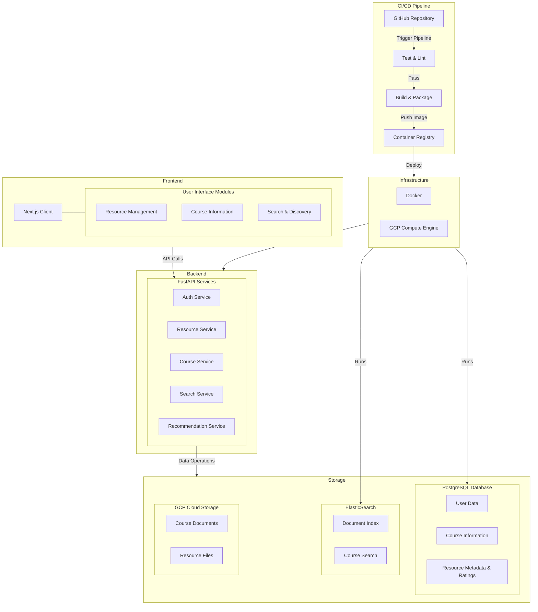

## Introduction

Our objective is to develop a specialized platform that streamlines access to high-quality academic resources while building a collaborative student community. The solution will be implemented as a cloud-based web application that allows students to upload, categorize, and access course materials. The platform will feature a sophisticated rating system that, combined with user preferences and relevance metrics, will intelligently recommend the most suitable resources to students.

## Architecture



### Tech Stack

- Python: 3.11.11
- Next.js: 15.1.6
- React: 19.0.0
- FastAPI: 0.115.0
- PostgreSQL:
- ElasticSearch:
- GCP Cloud Storage
- Docker

### File Structure

```

```

## How It Works

The Python/FastAPI server is mapped into to Next.js app under `/api/`.

This is implemented using [`next.config.js` rewrites](https://github.com/digitros/nextjs-fastapi/blob/main/next.config.js) to map any request to `/api/py/:path*` to the FastAPI API, which is hosted in the `/api` folder.

Also, the app/api routes are available on the same domain, so you can use NextJs Route Handlers and make requests to `/api/...`.

On localhost, the rewrite will be made to the `127.0.0.1:8000` port, which is where the FastAPI server is running.

To visit the auto-generated OpenAPI docs, go to `http://localhost:3000/api/py/docs`

## Environment Variables File

1.  Create an `env.dev` file.
2.  Configure the following content in `env.dev`:

```
GCP_PROJECT_ID="Your PROJECT ID"
GCP_BUCKET_NAME="Your Bucket name"
GCP_CREDENTIALS_PATH="Your GCP_CREDENTIALS_PATH"

SUPABASE_URL="Your SUPABASE_URL"
SUPABASE_KEY="Your SUPABASE_KEY"
SUPABASE_SERVICE_KEY="Your SUPABASE_SERVICE_KEY"

USER_EMAIL="Your USER_EMAIL"
USER_PASSWORD="Your USER_PASSWORD"

```

3. `GCP_PROJECT_ID`, `GCP_BUCKET_NAME`, and `GCP_CREDENTIALS_PATH` can be found in the GCP Console.
`SUPABASE_URL`, `SUPABASE_KEY`, and `SUPABASE_SERVICE_KEY` can be found in the API section of the Project Settings on the Supabase dashboard. 
`USER_EMAIL`, and `USER_PASSWORD`can be found in the users table of Authentication on Supabase.

First, create and activate a virtual environment:

```bash
python3 -m venv venv
source venv/bin/activate
```

Then, install the dependencies:

```bash
npm install
```

Then, run the development server(python dependencies will be installed automatically here):

```bash
npm run dev
```

Open [http://localhost:3000](http://localhost:3000) with your browser to see the result.

The FastApi server will be running on [http://127.0.0.1:8000](http://127.0.0.1:8000) – feel free to change the port in `package.json` (you'll also need to update it in `next.config.js`).

## How to test

Backend:

```bash
pytest [options]

# options
# markers =
#    unit: Unit tests
#    integration: Integration tests
#    e2e: End-to-end tests
... -m marker

# verbose output
... -v
# filter by test function name
... -k function_name
# check coverage
... --cov=api
# check coverage report
... --cov-report=html
# check coverage report in xml
... --cov-report=xml
```

Frontend:

```bash
# run all tests
npm test
# run specific test
npm test relative/path/to/test.tsx
# run with watch mode
npm run test:watch
# run with coverage
npm run test:coverage
```
## Docker

```bash
# Remove the old container (if it exists)
docker rm -f uwvault

# Rebuild the image
docker build -t uwvault .

# Run the container
docker run -d \
  --name uwvault \
  -p 3000:3000 \
  -p 8000:8000 \
  --env-file .env.dev \
  uwvault

# View logs immediately
docker logs -f uwvault
```
## Learn More

To learn more about Next.js, take a look at the following resources:

- [Next.js Documentation](https://nextjs.org/docs) - learn about Next.js features and API.
- [Learn Next.js](https://nextjs.org/learn) - an interactive Next.js tutorial.
- [FastAPI Documentation](https://fastapi.tiangolo.com/) - learn about FastAPI features and API.

You can check out [the Next.js GitHub repository](https://github.com/vercel/next.js/) - your feedback and contributions are welcome!
